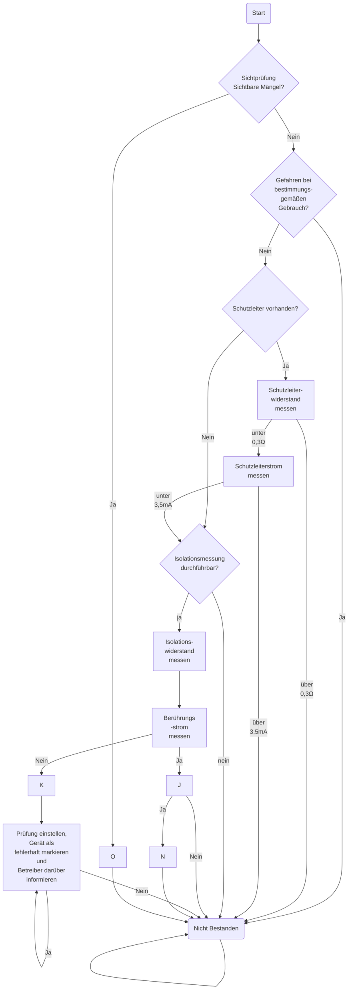

**21.08.2023**

- Isolationswiderstandtest I: (RISO)
- 1 MΩ auf 1    
- 299 MΩ auf 2
- IEA 0,01 mA  Auf 2

**23.08.2023**
### Erstellen Sie ein Flussdiagramm, nach dem Sie die Messungen nach VDE 0701 und VDE 0702 durchführen können.

I{Berührbare leitfähige Teile, die nicht mit PE verbunden sind?}
	J[Messung des Berührungsstromes]
	K[Messung des Ersatz-Ableitstroms]