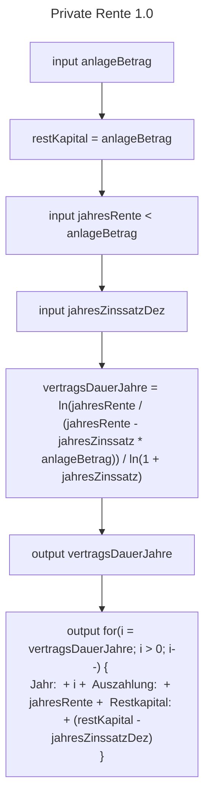
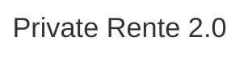

**02/11/2023**
# Rechenvorschriften - Interview
- Kunde hat größeren Geldbetrag (==Kapital==) zur Verfügung
	-> Wird ==eingezahlt==
	-> Kunde sagt wieviel er ==jährlich== als Rente ausgezahlt bekommen möchte
		-> Wird am ==Ende des Jahres ausgezahlt== (Betrag wird vom eingezahlten Kapital abgezogen)
		(Bis eingezahltes Kapital aufgebraucht wurde)
- ==Zinsen== werden jährlich gutgeschrieben
---
# Schleifen
- Besteht aus ==Schleifensteuerung== und ==Schleifenrumpf==
**Schleifensteuerung**:
Gibt an, wie oft (bzw. unter welcher Bedingung) Anweisungen (im Schleifenrumpf) abgearbeitet werden sollen
**Schleifenrumpf**:
Enthält die zu wiederholenden Anweisungen
## Java Wiederholungsanweisungen
**Bedingte Wiederholung**:
- *While-Schleife* (kopfgesteuert)
	- Prüfung der Bedingung ==vor== jedem Schleifendurchlauf 
	- ==Abweisende Schleife==
	- Wird nur durchlaufen wenn Bedingung ==true== zurückgibt (kein Durchlauf bei false)
- *do-While-Schleife* (fußgesteuert)
	- Prüfung der Bedingung ==nach== jedem Schleifendurchlauf
	- ==Akzeptierende Schleife==
**Zählergesteuerte Wiederholung**:
- *for-Schleife* (zählergesteuert)
	- Feste wiederholungszahl
	- ==Zählschleife==
---
# Zusatzaufgabe "Private Rente 2.0"
- Kunden möchten ==monatliche anstatt jährliche Auszahlung== der privaten Rente
- ==Zinsberechnung== muss angepasst werden
	- Für das jeweils aktuelle Jahr werden $\frac{13}{24}$ der Zinsen auf die Jahresrente gutgeschrieben
	- Für das übrige Geld werden die vollen Zinsen berechnet
- Weiteres Programm "Private Monatsrente" erstellen
---
# Flowcharts

___

---
# Implementierung
```java
import java.util.Scanner;

public class PrivateRente {
	
	public static Konto kontoErstellen(float initialKapital = 0) {
		Konto konto = new Konto(kapital = initialKapital);
	}
	
	public static void main(String[] args) {
		Scanner input = new Scanner(System.in);
		
		System.out.print("Kapital: ");
		float initialKapital = input.nextFloat();
		
		input.close();
		
		kontoErstellen(initialKapital);
	}
}
```

```java
public class Konto(float kapital = 0) {
	float kapital = kapital; 
	
	public static float zinsenBerechnen() {
		
	}
	
	public static void main(String[] args) {
		
	}
}
```

## Ideen
- Jahreszinssatz als Prozent eingeben und für Ausgabe in Dezimal umrechnen
- Store `jahresRente` in ArrayList
- Erweitern, sodass mehrere Konten erstellt werden können und deren Namen individuell bestimmt werden können
- Zusatzaufgabe
- Jährliche Zinsen berechnen (mit Berücksichtigung auf Veränderung des Kapitals)
$$n= \frac {ln( \frac{J}{J-rA})}{ln(1+r)}$$
- $n$ = Anzahl der Jahre, die der Vertrag dauert.
- $J$ = Jahresrente (in diesem Fall 12.000).
- $r$ = Jahreszinssatz (in diesem Fall 1,9% oder 0,019 als Dezimalzahl).
- $A$ = Anlagebetrag (in diesem Fall 100.000).