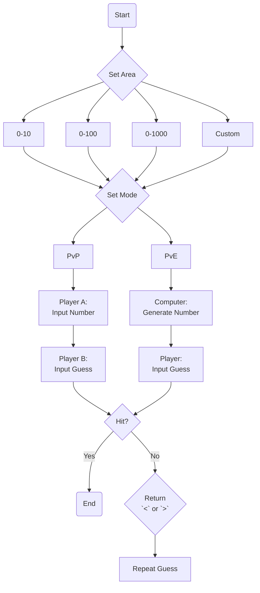

```mermaid
flowchart TB
	A(Start)
	
	B{Set Area}
	C[0-10]
	D[0-100]
	E[0-1000]
	F[Custom]
	
	G{Set Mode}
	H[PvP]
	I[PvE]
	
	J["Player A:
	Input Number"]
	K["Computer:
	Generate Number"]
	
	L["Player B:
	Input Guess"]
	M["Player:
	Input Guess"]
	
	N{Hit?}
	O(End)
	P{"Return
	`<` or `>`"}
		Q[Repeat Guess]
	
	A --> B
	B --> C & D & E & F --> G
	G --> H & I
	H --> J
		--> L
	I --> K
		--> M
	L & M --> N
	N -->|Yes| O
	N -->|No| P
		--> Q
```
